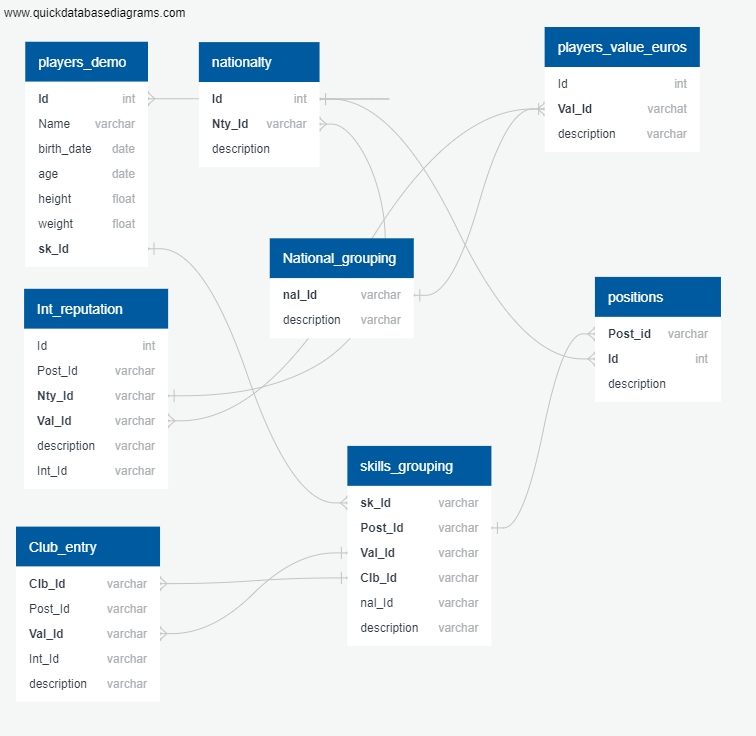
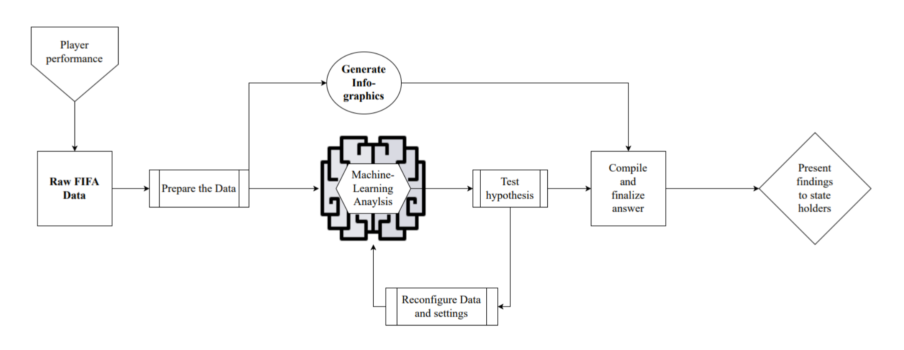
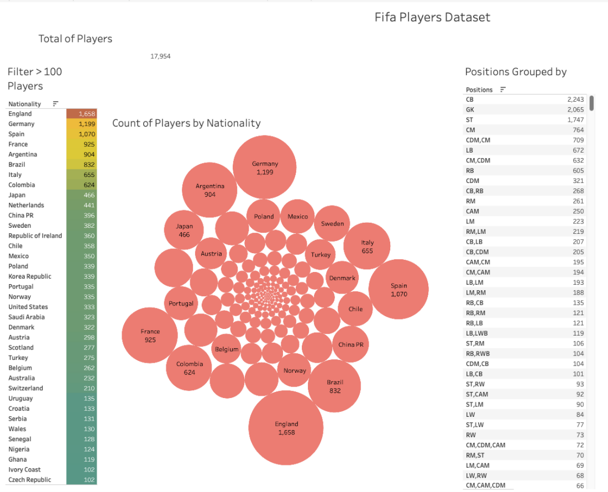
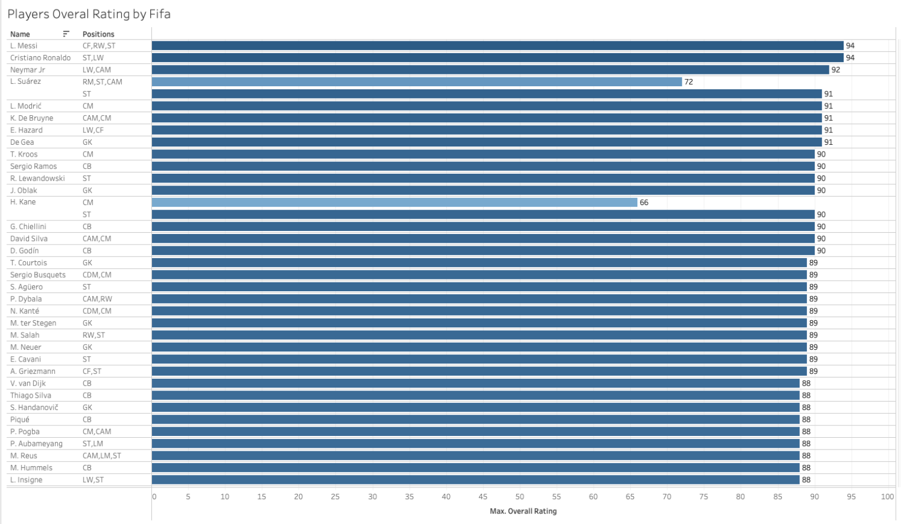

# FIFA_PlayerValue_ML - First Segment Project Deliverable 

## Presentation

### Database Question: Does the performance of a soccer player depends on the market value(euro)

Applying our knowledge of ETL process: extract the FIFA csv data from their respective files, transform the datasets by cleaning them up and joining them together, and load the cleaned dataset into a SQL database.We shall create entity relationship diagrams (ERDs), import data into a database, troubleshoot common errors, and create queries that use data to answer questions.

[Fifa Player Value ML Analysis Presentation.pptx](https://github.com/mshariqnaeem/FIFA_PlayerValue_ML/files/8460848/Fifa.Player.Value.ML.Analysis.Presentation.pptx)

#### Performing Exploratory Data Analysis on the data set.

# Planning Schedule

## Ability of Soccer players – Who is the best for their buck
Soccer is the biggest sport in the world. Millions across the world spend time and money in the pursuit of it, whether it be watching it in coffee shops, playing recreationally at their local soccer club, or placing bets in the fantasy leagues. The big question that many larger soccer clubs often ask themselves, knowingly or not, is who best to let go, and who best to keep. This question while never easy, has been made easier by the efforts of our team. 

## Why this specific topic

We understand at the end of the day, a team is only as good as its whole, and if a player is taking resources from the team that would be better be used elsewhere, then the whole team suffers. So, this brough us to the big question, does a player’s cost correlate to their performance. This is the main question that we will be asking, and using FIFA data, we will look at the cost of the player and compare their overall attributes. This is what we will look at in this analysis and create a machine learning model to judge whether or the pay really does correlate to performance, and if not, we can then present to the client recommendation on how best to optimize the performance of the team by adding or removing certain players.

This is of interest for many parties, key of those as previously mentioned, are these large football clubs. Expense can be easily upwards of 200k a year for a single player, and these expenses just like another business expense must be mitigated whenever possible. This is where our program will come it. With our dataset of FIFA players, we will target our variables of interest and create a data-frame out of them. This will then be place on a server, then from their fed into our machine learning algorithm who will parse through the data and generate expected values and compare them to real values. Our null hypothesis would be that there is no correlation between earnings and performance on the field. Our alternative hypothesis would be that there is a correlation, and by using figures we can determine whether or not that correlation is positive or negative. 

## Data Exploration 

While analyzing the original dataset we noticed that much of the data was in formats which would be unreadable by our machine learning model and would not be understandable by stakeholders to whom our final presentation of our results would be made. There were duplicate columns which would be redundant to our model and to our analysis, there were columns which certain players were being measured against when they did not play those positions (ex. a forward being measured with goalkeeper statistics).

These are some of the issues we came across in the original exploratory phase where we decided which columns and pieces of data we would need to remove for our machine learning model to work properly. 

## Presentation

### Selected Topic

**Machine Learning Question:** Are certain player atributes in football more important in determining a players actual Market Value (value_euro)?    
-	The Target variable for the machine learning model will be the Market Value of the player which is specified in the value_euro column of our dataset
-	Our data source is a CSV file with 18000 rows of player information and 90 columns of different statistics and information

**Business Question/Solution:** By analyzing athletes as sports analysts, can we advise teams on which players add most value to the team based on their performance in comparison to their market value?

### Reason Why We Selected This Topic

Football/soccer is the sport with the largest following around the world! Millions of people across the world not only gather to watch the sport but also spend money on the sport including sports betting in fantasy leagues, playing in recreational leagues, to large Clubs/Teams spending Millions on the best player in the world. We selected this topic as we feel that football/soccer just like any sport can be analyzed through statistics from which we can make further conclusions including a players Market Value.

**We as a team wanted to see if there is a trend between performance statistics and the market value of a player. Which categories are most important in determining a player’s market value?**

If we can answer these questions with our model, we could potentially start a start-up sports analytics firm which would provide football clubs with information of which players are worth purchasing based off of not only their performance but the value they add to the team and if that market value is worth paying.

### Questions to Answer with Data

1.	Can we create a supervised learning model which provides us with information which players performance are closer to their actual market value?
2.	Which statistical categories are most important in deciding performance of a player actually gives a certain player a higher value (is it speed, stamina, goal scoring etc.)?
3.	BONUS QUESTION: Is a player worth their market value? Or is a player overpaid/underpaid based off of their performance?

### Method of Communication

We will be using 2 main communication methods throughout this project. We have decided to use both Discord to attend meetings to discuss our progress in an agile and Waterfall environment. This will allow us to adapt to any changes throughout the project lifecycle while also managing to follow a linear project path as is typical in a traditional Waterfall methodology. We plan to do this by holding daily meetings to discuss the progress of the project as a whole and if anyone is experiencing any issues, and if there is an issue it can be addressed immediately vs putting the whole project and the rest of the group members on hold until that aspect is completed.

We chose Discord as our method of communication as it allows flexibility to open different channels to post content and manage communications through various breakout channels and groups. Discord also allows for different methods of communication and file sharing and is easily accessible by anyone who is part of the group. We will also be using Slack to communicate any issues that we are experiencing throughout the project with our **Assistant Instructor David Quispe**.

### Use of Tableau

We will be using Tableau throughout this machine learning model to create stories through visualizations. We will display these visualizations through various different means (bar charts, scatter plots, line charts etc.) to show different statistics and how they are relevant in determining the market value of a player.

After we have completed some data cleaning and tranformaiton we can make interpretations on which categories of statistics are most important to a players value through positive correlations. We understand that their may be outliers in our dataset which we will have to take into consideration and complete further analysis by dividing the players by positions, as not all players will have equal values in specific categories.

Below is an image of a Tableau bar chart of players overal rating as per the FIFA ratings. This is just an example of the types of visualizations that we can create with tableau.

### Usage of PostGres

Using the knowledge that we have learned regarding the ETL process, we will extract data from the CSV file **fifa_cleaned_initial.csv** (which is included below), transform the dataset by cleaning the data into a more readible and analyzable format, and load the cleaned dataset int an SQL dtaase. Using PostGres we shall create ERD's, import data into the database, and create queries to answer questions from our data.

[fifa_cleaned_initial.csv](https://github.com/mshariqnaeem/Capstone_Group12/files/8310532/fifa_cleaned_initial.csv)

### Resources Used

We will be using many tools including **Git and Github** to manage version control of our code and project progress. This allows us to return to any previous commits if there has been any issue throughout the project.

We will be using **Tableau Public** as our visualization tool to create stories to display the correlation of the data analyzed.

### Machine Learning Flowchart

We have also created a mock model of our Machine learning model which is displayed in the flowchart below.

## Database 
Applying our knowledge of ETL process: extract the FIFA csv data from their respective files, transform the datasets by cleaning them up and joining them together, and load the cleaned dataset into a SQL database.We shall create entity relationship diagrams (ERDs), import data into a database, troubleshoot common errors, and create queries that use data to answer questions.

### Planning Schedule

.Design an ERD that will apply to the data.
.Create and use a SQL database.
.Import Cleaned and designed ERD diagram tables into pgAdmin.
.Perform joins queries to create new tables in pgAdmin.

# Use the Quick Database Diagrams Tools

The quick DB diagram tools was used the designing the ERB diagram.

## Machine Learning 
We intend to use a Supervised Machine Learning model, specifically a linear regression model. We have a clear research question, and know that by using our historical data of players performance we can uncover if there is a relationship between a player’s value and their performance. Their value in Euros (a continuous variable) would be the target variable or dependent X variable. We’ll analyze many different independent Y variables or features that our model will learn from. The exact variables will be uncovered during our exploratory analysis but some possible examples are stamina, endurance, balance, ball control, etc.    

### Technical Set Up 
To build and execute this model we will be using the Scikit-learn machine learning library from Python and specifically have to import the Linear Regression module. 

## Tableau

We are using Tableau Public to create visualizations that are easy to read and understand.
Tableau will help us to have some insights and questions about our dataset, at the first point we used the insights and shared with our team to discuss what we could do next,and then we will make decisions and work on our ETL process. 

After some data transformation, we can reload the dataset and create more dashboards and stories to tell a bit more of our findings and convince the decision-makers with our analysis. 

- This initial dashboard allows us to interpret the data with numbers such as Total of players, grouped quantity by nationality filtered above 100 players.  

A chart of Player's Position brings attention to some data transformation that will have many categories that we should resume in the most important ones.

- Player's Overall Ratings can present to us the player's score, but again the many positions may affect our Machine Learning model to predict and answer our main question.
That will lead us to categorize this column and proceed with our data Extract Transform and Load process.

## Methods of communication and Cooperation 

One of the key requirements in any successful project is a team which communicates and cooperates effectively. Large tasks such as this require everyone to work together to make sure that the client receives the desired outcome on time and without delays. We have put a lot of thought into how during the span of this project we will be communicating and sharing our progress on our respective parts of the project, to this end we created a Discord server. This is where the bulk of our communications takes places as discord is a platform which allows for file sharing, video or voice calling, chat logs and chat history to be saved. This allows us to rapid share files to the whole group and actively talk while working on our tasks. Another method we are using to keep up communication between the team is daily meetings to update us and discuss openly any concerns we face individually or collectively. For example, if one of us finds a specific aspect of the project challenging or cannot complete a task on time, our daily meetings will allow us to redistribute tasks and solve our issues so that we can collectively move forward. We feel that using this method would allow us to “square the circle” between Agile and Waterfall method. In addition, we plan to communicate our work process to the client by providing a log of the discoveries made and plan changes to our project. This will ensure transparency with all parties and will be available in a section of the README. This allows interested parties to keep up with advancements of the project as well as the thoughts of the team.

## In Closing

We know that with a well laid plan, we can achieve the desired goal on time, and get the answers to the stack holders. Putting together machine learning, thoughtful insights, story driven data, and a well-organized team, we know that we will be able to deliver on our goal, of finding what indicators to look for, to find the true monetary value of a player.

We know that with a well laid plan, we can achieve the desired goal on time, and get the answers to the stack holders. Putting together machine learning, thoughtful insights, story driven data, and a well-organized team, we know that we will be able to deliver on our goal, of finding what indicators to look for, to find the true monetary value of a player.

## Week 2

## Data Exploration

The nature of the data makes it trying at times to properly conceptualize what you are looking at. The task of creating something out of numbers and terms is a process that requires a great deal of thought and consideration. During the proletary process of cleaning and parsing the data, we started to play with it, creating small charts and grouping data to see any possible correlation, or see how the data related to itself in a more visual manner. From this process we grew in our understanding of the data and could really see the story that it was presenting to us. From the onset, our goal re

ed the same, to determine the value of a soccer player, and from our exploration we started to see specific trends present themselves to us. The first was the correlation between ‘age’ and ‘value’, showing a characteristic positive correlation. Others as well were of great interest to us, from the cleaning process we started to group players positions together to get a better picture of the ‘value’ of specific positions, and to compare them to each other to see what the trends between position and value of the player were, were some positions seen as more valuable or were some seen as less.
From this trend in our exploration emerged the thought of the clubs themselves. Were some teams, due to coming from a nation who may not be able to afford to pay their plays as much as a country like France or Spain. This would not neccesarily reflect that the players of that team are of low value rather that they were being paid under the potential market value. This would be an area of interest for our stake holders as if we can find players who over preform for their value, we can give them the appropriate suggestions so that they can more so optimize their team structure.

## Data ETL

From the process of data exploration, we as well came upon some challenges with the initial data set. A lot of missing values, duplicate values as well as values that were unnecessary for our current needs. As previously stated, position on the field was a feature what was in interest to us, however we had the issue of people holding several positions at once. This was an issue when we attempted to group them together as there were a multitude of combinations and variations that, while important on the micro level, when attempted to derive the value of a player based on position made in near to impossible. Thus, to over come this challenge we divided the positions into 4 broader, more manageable categories of, “Forward(FW)”, “Mid-Field (MF)”, “Down-Field (DF)” and “Goal-Keeper(GK)”. This will allow us to more closely look at trends in these broader positions as well as compare them with a larger sample, making our findings more meaningful. Furthermore, we also have been using the player ID as a index, allowing us to easily merge and track the transformed or altered values to the originals. This means if later on if we find for example Forwards are of more value, we can trace back our steps and find what specific positions in the broader Forward category are of higher value.
Another issue we had to resolve in the data is the player value itself. Due to some outliers, player value was from the tens of thousands to the tens of millions. This discrepancy reeded its head as we attempted to make for informative graphs of the data. The process of fixing this was to take our “euro value” columns and simply divide all the values by 100,000. This would allow us to generate more digestible graphs, as well made prepping the data for our Machine Learning algorithms.

## Machine Learning

We intend to use a Supervised Machine Learning model, specifically a linear regression model. We have a clear research question, and know that by using our historical data of players performance we can uncover if there is a relationship between a player’s value and their performance. Their value in Euros (a continuous variable) would be the target variable or dependent X variable. We’ll analyze many different independent Y variables or features that our model will learn from. The exact variables will be uncovered during our exploratory analysis but some possible examples are stamina, endurance, balance, ball control, etc.  

From here, with a better handle on the structure of our data, we pushed forward with another key aspect of the project, and that is creating a Machine Learning algorithm that would allow us to present insightful and actionable advice for our stake holders. After much effort and tweaking we have successful come of with several models that will allow us to create some powerful projections using the presented information. The first we knew we wanted was a supervised Machine Learning model that created a linear regression. The purpose of this was to find a positive correlation between a chosen value and the players value. The reason for this is that if we can find what is positively correlated with their value, we can then present that to stake holders to show them what to look out for in a player. Furthermore, slack holders when scouting for players can simply feed into the program or look at past test and find what is a key sign that a player is more likely than not to be of value. It can also inform them on already existing players and would allow them to judge if they are over or under their market value as judged by the algorithm. 
Another Machine Learning model is our clustered data. From a simple attempt to see if it would generate some interesting findings, this model has come back with some very promising features. After some attempts, it came back with four very well-defined clusters of data points. While still in the early stages of analysis we are eager to see what we can learn from this to present to the stack holders.
While our current models are not complete, they are all showing promising results. We know after some more alterations and tweaking we will be able to come backing with some grasping insights into the data, as well as actionable outlooks

## Dashboard

We have included the link to our google slides presentation of our dashboard below. We will be using Tableau to form interactive elements and create our dashboard as we found that there is a way to connect a database and machine learning model to pull data into Tableau, from which we can pull our data and create a simple interface for end-users to access the information they require from a preset up interactive menu which we will further develop with the progression of our project.

We have included the Google Slides link below and also have included a copy of the presentation in PPT format in our Dashboards folder on Github.

https://docs.google.com/presentation/d/1yKwIa9QqO8fjDFDkO8IffPck5ieb2ZayTHQYr9WRYRc/edit?usp=sharing

## Week Two in Closing

We have all made steady and consistent progress on our portions of the project. Already at this stage we have uncovered many interesting features we are eager to present as we polish them into something that is clearer. As work marches on we have all contributed much time and effort into making sure that all the stake holders will be satisfied in the results, as we are confident that our final product will deliver in what our design goals outlined. 
We know that with a well laid plan, we can achieve the desired goal on time, and get the answers to the stack holders. Putting together machine learning, thoughtful insights, story driven data, and a well-organized team, we know that we will be able to deliver on our goal, of finding what indicators to look for, to find the true monetary value of a player.

Structure for final read me- for your heading you may be able to repurpose already written content, have to create your own, and get screenshots/ add images: 
# Introduction- done/ repurpose- Shariq
# Introduction- done/ repurpose- Shariq
## What is our topic and why we chose 

Our topic is the valuation of Football/Soccer players!

Soccer is the biggest sport in the world. Millions across the world spend time and money in the pursuit of it, whether it be watching it in coffee shops, playing recreationally at their local soccer club, or placing bets in the fantasy leagues. The big question that many larger soccer clubs often ask themselves, knowingly or not, is who best to let go, and who best to keep. This question while never easy, has been made easier by the efforts of our team.

## Questions we aim to answer- and business relation

The main question we want to answer is **what categories determine a player's market value?** Is it a statistical category such as speed? is it a non-statistical based category such as nationality? Is it a players potential for growth? These are all factors we need to take into consideration when analyzing our database and creating our machine learning model.

This is of interest for many parties, key of those as previously mentioned, are these large football clubs. Expense can be easily upwards of 200k a year for a single player, and these expenses just like another business expense must be mitigated whenever possible. This is where our program will come it. With our dataset of FIFA players, we will target our variables of interest and create a data-frame out of them. This will then be place on a server, then from their fed into our machine learning algorithm who will parse through the data and generate expected values and compare them to real values. Our null hypothesis would be that there is no correlation between earnings and performance on the field. Our alternative hypothesis would be that there is a correlation, and by using figures we can determine whether or not that correlation is positive or negative.

## Where we got data- link to resources folder 

The source of our data is a CSV file which we found from data.world. This CSV file contains roughly 18,000 rows of player data with 90 columns of categories and statistical measures. We have included the link to the original source of the dataset below.

https://data.world/raghav333/fifa-players

## The systems we used- down to the programming languages 

For the project we had to use a variety of languages and tools to complete our analysis and machine learning model. 

**As there were multiple different tools used we have made a short list below**

- Postgres SQL + PgAdmin
- Python + Jupyter Notebook /
  numpy
  matplotlib
  pandas
  seaborn
  sklearn
  sqlalchemy
  psycopg2
- Tableau
- HTML

# ETL process and exploration/ analysis on tableau- already written- Marcio

# Database- need an updated ERD with- raw, cleaned, ML, front- olu

# Machine Learning

We intend to use a Supervised Machine Learning model, specifically a linear regression model. We have a clear research question, and know that by using our historical data of players performance we can uncover if there is a relationship between a player’s value and their performance. Their value in Euros (a continuous variable) would be the target variable or dependent X variable. We’ll analyze many different independent Y variables or features that our model will learn from. The exact variables will be uncovered during our exploratory analysis but some possible examples are stamina, endurance, balance, ball control, etc.  

The process of getting a machine learning algorithm up and running was a challenge to say the least. We took many paths and not all were fruitful, but nonetheless we got to a point where can confidently say that we have a model which can predict the transformed euro value and what skills would come time that. 

At first, we tried a multitude of models all trying to get an idea of the nature and structure of the data. We tried a cluster model, and several linear graphs to get a handle on the data. Our base machine learning model, which just took the integers and decimals from the cleaned data into consideration only yeilded an accuracy score of 63. From this we could see that the data behaved in manner that we at first didn’t expect. From several projections the data seemed to trend in a more exponential in nature, and so a regular linear regression would not do. After much deliberation we concluded the large disparities between soccer player salaries must be addressed, as with some players, the difference between what their values is could be in the tens if not hundreds of millions. Thus, to tackle this issue, we attempted to standardize the data by apply the log function to the target value to standardize it. After we applied this as well as some other tweaking like dropping string values, columns that were the majority null values, etc. we finally got to a point where our machine learning algorithm was yielding a rather high accuracy score above 90. 

After getting the feature value of our machine learning to a high degree, we then removed overshadowed the other features. Finally, after several more tweaks we got to a point where we can take the skills of a player and produce their logged value. While this isn’t exactly what we desire, due to the nature of the data it was the only to proceed to conduct the machine learning, as any other method only yielded poor to no significate results. None the less we are proud of our achievements in we accomplished.

# Dashboard
We are using Tableau Public to create visualizations that are easy to read and understand. Tableau helped us to have some insights and questions about our dataset, and at first we used this tool to find insights and share findings with our team to discuss what we could do next, and then make decisions and work on our ETL process.
After some data transformation, we reloaded the dataset and created more dashboards and stories to provide users with summary statistics and analysis of player’s statistics, such as country of origin, club teams, etc. This is our first interactive component that allows users to view graphs of all Fifa players overall or find summary statistics of one individual player. 
Our second interactive component connects to the data from our machine learning model and allows users to find the value, predicted value and top attributes that influenced the value for that specific player in the machine learning model. This search engine was created using HTML and Javascript.  To complement the machine learning search engine there is an additional tableau dashboard that shows visualizations of player positions, values and predicted values. 
## Interactive Demo 
Please follow the link below to find a video showing both of our interactive elements. 
https://drive.google.com/file/d/1m9mVxkuoDX6Mbe2-w6Fzsxj1jPK-bHoB/view?usp=sharing

# Communication Protocol
We will be using 2 main communication methods throughout this project. We have decided to use both Discord to attend meetings to discuss our progress in an agile and Waterfall environment. This will allow us to adapt to any changes throughout the project lifecycle while also managing to follow a linear project path as is typical in a traditional Waterfall methodology. We plan to do this by holding daily meetings to discuss the progress of the project as a whole and if anyone is experiencing any issues, and if there is an issue it can be addressed immediately vs putting the whole project and the rest of the group members on hold until that aspect is completed.

We chose Discord as our method of communication as it allows flexibility to open different channels to post content and manage communications through various breakout channels and groups. Discord also allows for different methods of communication and file sharing and is easily accessible by anyone who is part of the group. We will also be using Slack to communicate any issues that we are experiencing throughout the project with our **Assistant Instructor David Quispe**.

# Submitted by Group 12 
* Ryan Mota 
* Shariq Naeem
* Sydney Kieswetter 
* Marcio Ciano 
* Olufemi Iman
